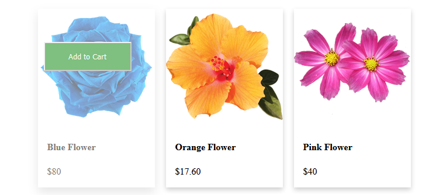
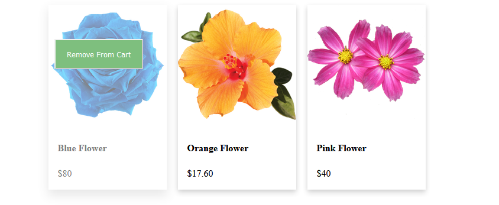

I have managed to finish almost all the requirements for the front end except for the red circle on top of the card.
So instead I made sure that when a user clicks the button, the item remains blurred as a sign of the item is in the cart.
There are some bugs with the click function, but if the user clicks on the button, there aren't any.

You only need to open index.html in the browser.

For the backend, I really tried very hard to work with postgres but for some reasons I couldn't properly install it in
my system and it kept showing errors of incompatibility with my Ubuntu version. 
I wasted far too many days on trying to fix this error and this is why I couldn't implement it.

But my startegy to integrate the backend with database was to use Jquery. 

The states of the cards are shown below.

